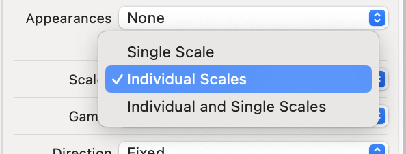
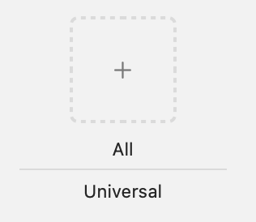
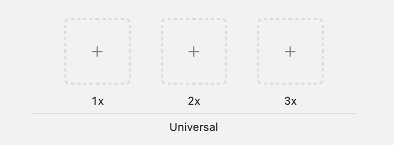
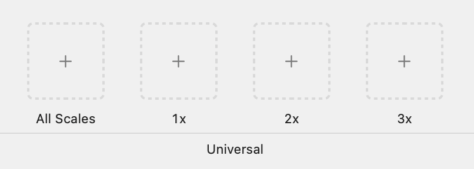

# The Joys of `actool` and Vector Assets

Apple has supported vector image formats in asset catalogs for several years now, however the behaviour of vector assets is not well documented. When I recently dug into it things got very interesting, and I ended up filing a number of feedbacks to Apple. I believe this is all accurate as of Xcode 26.

This information may be useful in greatly reducing the size (and compilation time) of your asset catalog.

## Basics

Apple Asset Catalog documentation is [here](https://developer.apple.com/library/archive/documentation/Xcode/Reference/xcode_ref-Asset_Catalog_Format/index.html).

`actool` is the asset compiler that generates `.car` files. It has a man page. 

`assetutil` is a utility for inspecting and manipulating `.car` files. It has a man page. It also will show you options when run without any arguments.

[`Samra`](https://github.com/NSAntoine/Samra) is a useful GUI for displaying the contents
of `.car` files.

Officially `actool` supports `PDF` and `SVG` as vector formats. Some of the Apple documentation hasn’t been updated to mention SVG support.

## How Images Are Generated At Compile Time

Image generation depends heavily on the `Scale` option in Xcode.

### Scale: Single Scale

With a raster image, actool will generate a single raster at 1x scale

With a vector image, actool will generate 1x, 2x and 3x rasters. If `preserves-vector-representation` is set, it will record the vector data from the single image.

### Scale: Individual Scales

With only raster images, actool will only generate rasters for the scales you assign images to.

With a mix of vector and raster images, actool will use the rasters for the scales that have them assigned, and then will use the lowest scaled vector image to create the missing rasters. If `preserves-vector-representation` is set, it will record the vector data from the highest scaled vector. So if you have a `star1.svg` in 1x, `star2.png` in 2x and `star3.svg` in 3x, it will generate the 1x raster from `star1.svg`, the 2x raster from `star2.png`, the 3x raster from `star3.svg` and keep the `star3.svg` data as the preserved vector data.

With a single vector image in any slot, actool will use the vector to generate the missing rasters and will keep that vector data if `preserves-vector-representation` is set

With multiple vector images, actool will use the vector for the scale that has them assigned, and then will use the lowest scaled vector image to generate the missing rasters.  If `preserves-vector-representation` is set, it will record the vector data from the highest scaled vector. So if you have a `star1.svg` in 1x and `star3.svg` in 3x, it will generate the 1x raster from `star1.svg`, the 2x raster from `star1.svg`, the 3x raster from `star3.svg` and keep the `star3.svg` data as the preserved vector data.

### Scale: Individual and Single Scales

You will get an error/warning if you attempt to put a raster in the ‘All Scales’ slot unless it is the only slot used in which case actool will generate a single raster at 1x scale.

If you have a vector in the All Scales slot, actool will generate rasters for the scales that have them assigned (whether it be raster or vector data) and then the vector from All Scales for the other slots. 

> [!IMPORTANT]
> If preserves-vector-representation is set, actool will keep the vector in the `All Scales` slot **unless** you have vector data in the 2x or 3x slots. In this case it will > preserve the vector data in the highest scale slot. So if you have a `star1.svg` in `All > Scales`, `star2.png` in 2x and `star3.svg` in 3x, it will generate the 1x raster from `star1.svg`, the 2x raster from `star2.png`, the 3x raster from `star3.svg` and keep the > `star3.svg` data as the preserved vector data.

> [!NOTE]
> There is a super weird case if you have vector data in “All scales”, 1x and 3x, `actool` fails with `ERROR: Identical key for two renditions.`

#### Summary
This table attempts to outline all of the tested cases for `Individual and Single Scales` (`preserves-vector-representation` is set in every case).

| Inputs |  |  |  | Outputs |  |  |  | Feedback filed |
| ----- | :---- | :---- | :---- | ----- | :---- | :---- | :---- | ----- |
| **All Scales Data** | **1x data** | **2x data** | **3x data** | **1x Raster** | **2x Raster** | **3x Raster** | **Preserved vector data** |  |
| vector1 | empty | raster1 | empty | vector1at 1x | raster1 | vector1at 3x | vector1 |  |
| raster1 | empty | empty | empty | raster1 | empty | empty | empty | FB13736016 |
| raster1 | vector1 | empty | empty | \#error | \#error | \#error | \#error |  |
| vector1 | empty | vector2 | empty | vector1at 1x | vector2 | vector1at 3x | vector2 | FB13736055 |
| vector1 | vector2 | empty | empty | vector2 at 1x | vector1at 2x | vector1at 3x | vector1 |  |
| vector1 | vector2 | empty | vector3 | \#error | \#error | \#error | \#error | FB13736032 |

## How Images Are Selected At Render Time

### UIKit

If you do not have `preserves-vector-representation` set on the imageset, the image will be the scaled raster image appropriate for the display.

If you have `preserves-vector-representation` set on the imageset, the image will be the scaled raster image appropriate for the display if the image requested is the exact dimensions of the raster, otherwise it will draw using the preserved vector data. So if you have a raster that is 400x400 pixels on a 2x display, and you have a 200x200 point imageview, it will use the raster. If the imageview is 201x200 points, it will use the preserved vector.

### Swift UI

If you do not have `preserves-vector-representation` set on the imageset, the image will be the scaled image appropriate for the display.

If you have `preserves-vector-representation` set on the imageset, Swift UI appears to only use the vector data no matter what size of image is requested.

## How Size Attributes Are Calculated For Vector Images:

### SVG

`actool` first attempts to use the `<svg height/width>` tags if they exist. It then looks for a `<svg viewbox>`. Finally if neither of these exist it will fall back to the rendered artwork bounds.

### PDF

`actool` first attempts to use the mediabox if it exists, and then falls back to the rendered artwork bounds.

## How `actool` Rasters Vector Images

When vector images are rendered to rasters by `actool` they are rendered at multiples of the size attributes.

This means that if you have an `SVG` file with 5000x5000 as its size values that you are going to get a 5000x5000 (@1x), a 10000x10000 (@2x) and a 15000x15000 (@3x) image created and compiled into your car file. A 15000x15000 image is a 225 megapixel image that is almost certainly never going to get rendered. Between the 3 image sizes you have roughly 350 mega pixels (225 @3x, 100 @2x and 25 @1x) for `actool` to compress, and then those images live in your `car` file. Even with asset stripping most of your users are going to end up with either the 2x or 3x images on their devices.

# Some Best Practices

## Use a reasonable bounding box on your vector files

Until Apple gives us an option to *not* generate rasters from the vector data (FB13741170) make sure that your vector files have a reasonably sized bounding box (100x100?) because your vector is going to be rasterized at 1x, 2x and 3x sizes. Making the bounding box too small (like 1x1) may end up with rounding errors, and other software that draws previews will make it difficult to see what you are looking at.

## Make sure that your vector scales well in both dimensions

Anything with strokes will often have difficulty scaling unless you are careful.

## Always set `preserves-vector-representation` if you have a vector in your asset

The only reason I can think of to avoid setting this would be if you explicitly want rasters (possibly due to performance issues). Vectors generally are much smaller than
rasters.

## Put your vector data in the “all scales” slot and only use rasters for the 1x, 2x, and 3x slots

Otherwise what actually gets rendered using actool can get very confusing.

# Tricks to optimize compile time/build size

## 1x pixel rasters

Put your vector image in `All Scales`. Create a 1x1 pixel png. Use that for the 1x/2x/3x images. Make sure that `preserves-vector-representation` is set. In this configuration unless you explicitly request a 1x1 pixel image, your vector will be used, but actool won’t raster it.

> [!NOTE]
> You cannot do this trick with `svg` files. It only works for `pdfs`. I do not know why. You may want to consider using [svg2pdf](https://github.com/dmaclach/svg2pdf) to convert your `svg` files to `pdf`. `FB13735188`

> [!NOTE]
> Putting your vector image in the 3x slot and hoping that it will raster at ⅔ and ⅓ sizes for the 1x and 2x slots does not appear to work.

